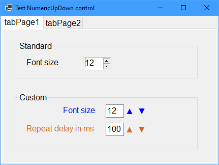
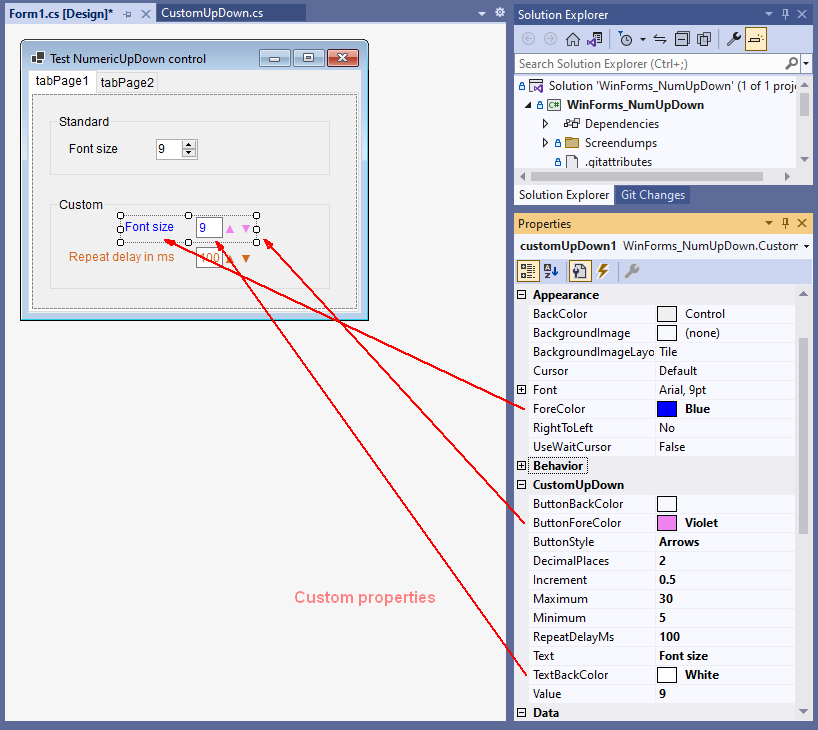

# WinForms_NumUpDown

  

A Custom Flat-style Numeric UpDown Control with a simple demo application written in .NET 6   
   
   

This custom Control is just a single file: CustomUpDown.cs which can easily be added to your project.  
Tested with .NET 6 but should also work in .NET 4.8.  
Based on Control, which is the most powerful way to create a Control, but not the easiest.  
More information about different types of custom Controls can be found here: [Types of custom controls](https://learn.microsoft.com/en-us/dotnet/desktop/winforms/controls/custom?view=netdesktop-6.0)

## Features:

- Optional label
- Repeat buttons
- Arrow or +- style
- Color properties for label, textbox and buttons

Note that the repeat button functionality is implemented without using a Timer.

## Color usage

