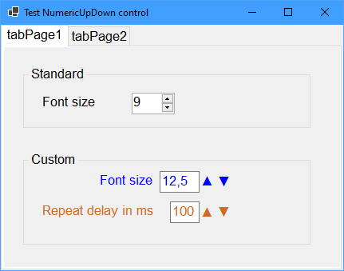

# WinForms_NumUpDown

  

A Custom Flat-style Numeric UpDown Control for .NET 6  

Features:

- Optional label
- Repeat buttons
- Arrow or +- style

Note that the repeat button functionality is implemented without using a Timer.
